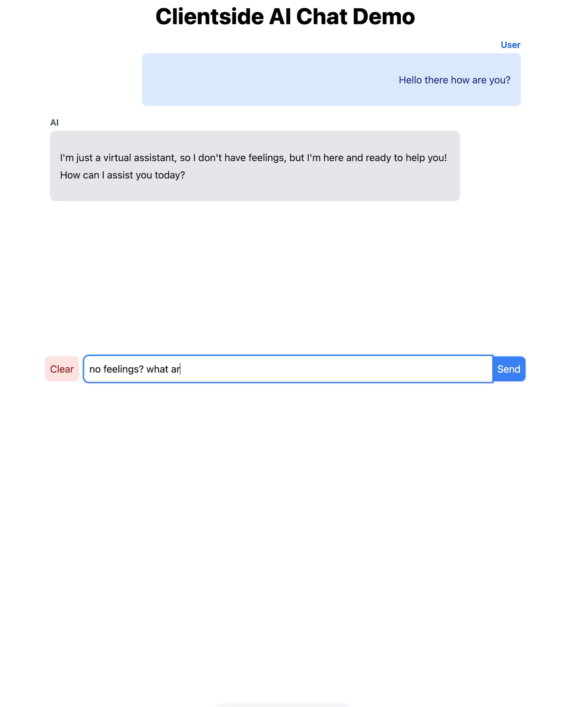
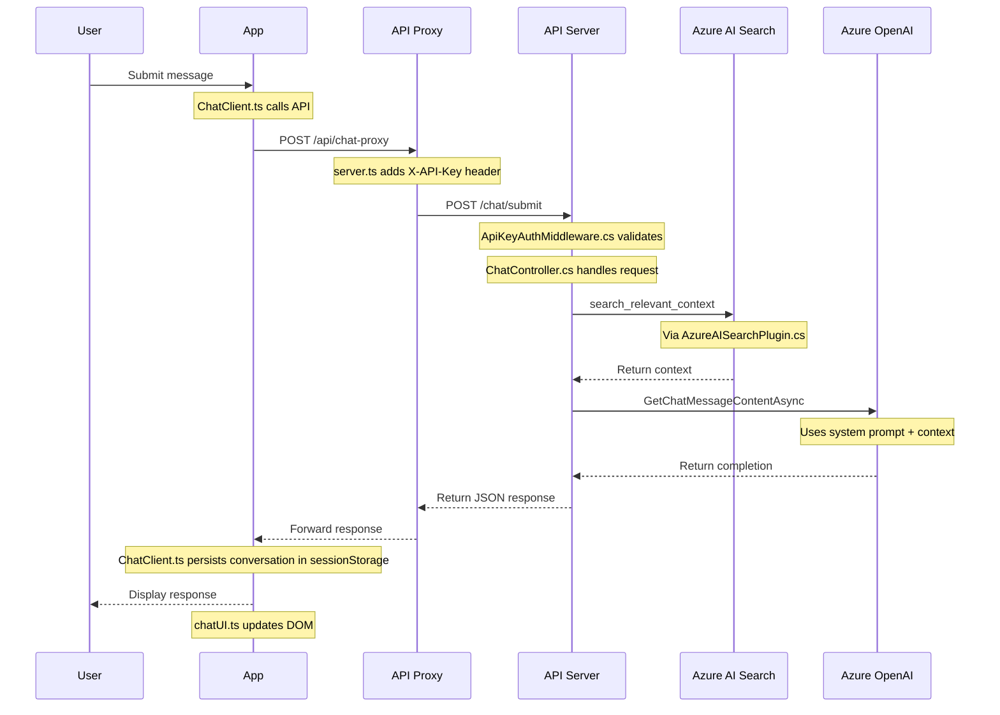

# Enterprise AI Proxy Client

A lightweight TypeScript client application demonstrating Enterprise AI API integration with minimal dependencies.

**Demonstrates**:

- Secure API key handling via proxy server, so no client-side API key exposure
- Browser based conversation persistence via `sessionStorage` api.
- Markdown rendering support



## Tech Stack

- TypeScript with no UI Framework
- Tailwind CSS
- Node.js server for a proxy'ing Chat request

## How it works

- `server.ts`: Minimal web server to serve demo app and proxy chat requests.
- `index.html`: Application shell
- `ChatClient.ts`: Core chat API logic and state management
- `chatUI.ts`: DOM manipulation and UI updates
- `markdownConverter.ts`: Message formatting



## Developer Setup

1. Install NPM dependencies
2. Update any configuration for API url or API key in `./src/server.ts`
3. Start the real API server (the dotnet one)
4. Start the proxy client demo

```bash
cd EnterpriseAI.ProxyClient
npm install
npm run dev
```

The following is the default configuration:

```ts
const config = {
  apiUrl: process.env.API_URL ?? "http://localhost:5229",
  chatRoute: process.env.CHAT_ROUTE ?? "/chat/submit",
  apiKey: process.env.API_KEY ?? "my-api-key",
  apiKeyHeader: process.env.API_KEY_HEADER ?? "X-API-KEY",
};
```
