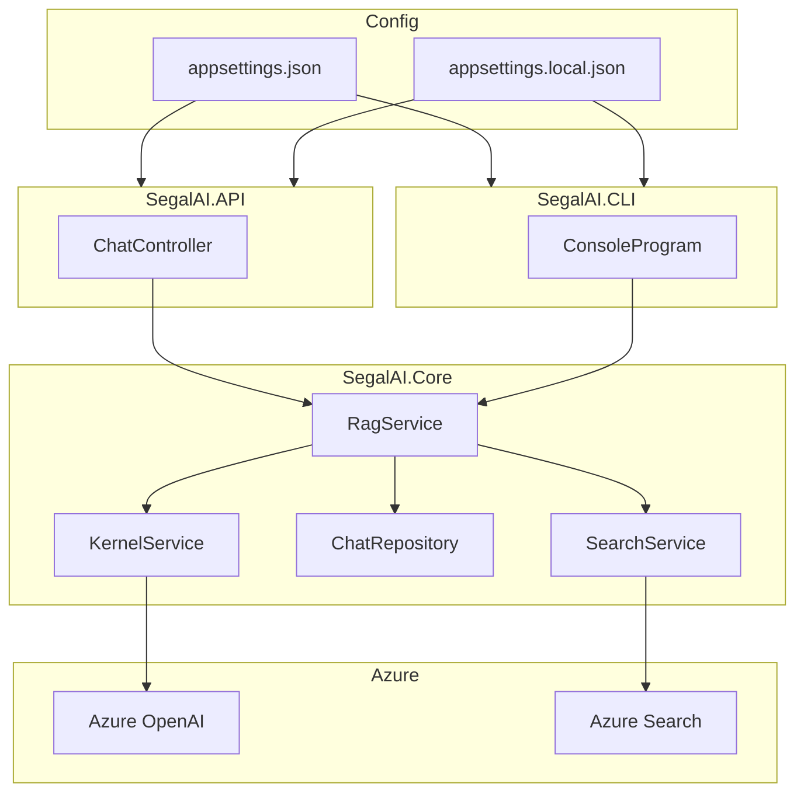

# Segal AI Demo

## Purpose

Segal AI Demo is a web API and CLI application designed to facilitate AI-driven chat interactions. It integrates Azure's OpenAI and search services to provide context-aware, retrieval-augmented conversations, solving the problem of creating informed and intelligent chat experiences.

## Tech Stack

| Name                                   | What is it?                                                                                                 |
| -------------------------------------- | ----------------------------------------------------------------------------------------------------------- |
| **ASP.NET Core**                       | A framework for building web APIs and services.                                                             |
| **Swashbuckle.AspNetCore**             | [Swagger](https://www.nuget.org/packages/Swashbuckle.AspNetCore) integration for Swagger API documentation. |
| **Microsoft.Extensions.Configuration** | A library for managing application configuration.                                                           |
| **Microsoft.SemanticKernel**           | A library for semantic kernel operations.                                                                   |
| **Azure.Search.Documents**             | A library for integrating with Azure Search services.                                                       |

## Project Structure

| Path          | Purpose                                                                     |
| ------------- | --------------------------------------------------------------------------- |
| /SegalAI.Core | Contains the core business logic and services used across the project.      |
| /SegalAI.API  | Hosts the Web API implementation, including controllers and configurations. |
| /SegalAI.CLI  | Contains the console application for testing core functionalities.          |
| /docs         | Provides documentation related to project setup and development.            |

## Developer Setup

### 1. Install Required Tooling

- Install the [.NET SDK](https://dotnet.microsoft.com/download) (version 6.0 or later).

### 2. Clone the Repository

Open a terminal and clone the project:

```bash
git clone <YOUR_REPO>
cd SegalAI
```

### 3. Setup Local Configuration

Each project (API and CLI) requires its own local settings file for secrets.

1. For the API:

   ```bash
   cd SegalAI.API
   cp appsettings.local.Example.json appsettings.local.json
   # Edit appsettings.local.json with your secrets
   ```

2. For the CLI:

   ```bash
   cd SegalAI.CLI
   cp appsettings.local.Example.json appsettings.local.json
   # Edit appsettings.local.json with your secrets
   ```

> [!NOTE]
> The `appsettings.local.json` files are gitignored and won't be committed.

### 4. Build and Run the Project Locally

1. Restore and build the solution:

   ```bash
   dotnet restore
   dotnet build
   ```

2. Run the API:

   ```bash
   dotnet run --project SegalAI.API
   ```

3. Run the CLI:

   ```bash
   dotnet run --project SegalAI.CLI
   ```

4. Optionally, run the API with watch mode (auto-recompile):

   ```bash
   dotnet watch run --project SegalAI.API
   ```

## Local Settings Setup

Each project (API and CLI) needs its own local settings file for secrets.

1. For the API:

   ```bash
   cd SegalAI.API
   cp appsettings.local.template.json appsettings.local.json
   # Edit appsettings.local.json with your secrets
   ```

2. For the CLI:
   ```bash
   cd SegalAI.CLI
   cp appsettings.local.template.json appsettings.local.json
   # Edit appsettings.local.json with your secrets
   ```

## Architecture

- **Backend (API Server)**:

  - **Technology**: ASP.NET Core
  - **Role**: Hosts the web API for chat interactions.
  - **Connections**: Integrates with Azure OpenAI and Search services for AI-driven functionalities.
  - **Hosting**: Can be hosted locally or on a cloud platform.

- **CLI Application**:

  - **Technology**: .NET Console Application
  - **Role**: Tests core functionalities of the AI services.
  - **Connections**: Uses the same core services as the API server.

- **Core Services**:

  - **Components**: AIServiceConfig, KernelService, RagService, etc.
  - **Role**: Manages AI operations, including question extraction and answer generation.
  - **Connections**: Interfaces with Azure services and repositories for data handling.

- **Azure OpenAI and Search Services**:

  - **Role**: Provides AI capabilities and document search functionalities.
  - **Connections**: Accessed by both the API server and CLI application for processing chat interactions.

- **In-Memory and Database Repositories**:

  - **Role**: Store and retrieve chat messages.
  - **Connections**: Used by core services to manage conversation data.
  - **Note**: Database repository is not fully implemented.

- **Configuration Management**:
  - **Files**: `appsettings.json`, `appsettings.local.json`
  - **Role**: Manages application settings and secrets.
  - **Connections**: Used by both API and CLI applications for configuration.



## External APIs

| Name                 | Usage Explanation                                                         | Source Code                                                          |
| -------------------- | ------------------------------------------------------------------------- | -------------------------------------------------------------------- |
| Azure OpenAI API     | Used for generating text responses and embeddings in the chatbot.         | [KernelService.cs](SegalAI.Core/Services/KernelService.cs)           |
| Azure Search Service | Used for querying documents with semantic and vector search capabilities. | [AzureSearchService.cs](SegalAI.Core/Services/AzureSearchService.cs) |

## Exposed Endpoints

### Chat API Endpoints

#### 1. Get Conversation History

```http
GET /chat/{conversationId}
```

Retrieves all messages for a specific conversation.

**Parameters:**

- `conversationId` (path parameter): Unique identifier for the conversation

**Response:**

- `200 OK`: Returns an array of chat messages
  ```json
  [
    {
      "role": "user",
      "content": "message content"
    },
    {
      "role": "assistant",
      "content": "response content"
    }
  ]
  ```
- `404 Not Found`: If the conversation doesn't exist

#### 2. Submit Message

```http
POST /chat/{conversationId}/submit
```

Submits a new message to a conversation and gets an AI response.

**Parameters:**

- `conversationId` (path parameter): Unique identifier for the conversation
- Request Body:
  ```json
  {
    "message": "string"
  }
  ```

**Response:**

- `200 OK`: Returns the AI response as a string
- `400 Bad Request`: If the message is empty or invalid
