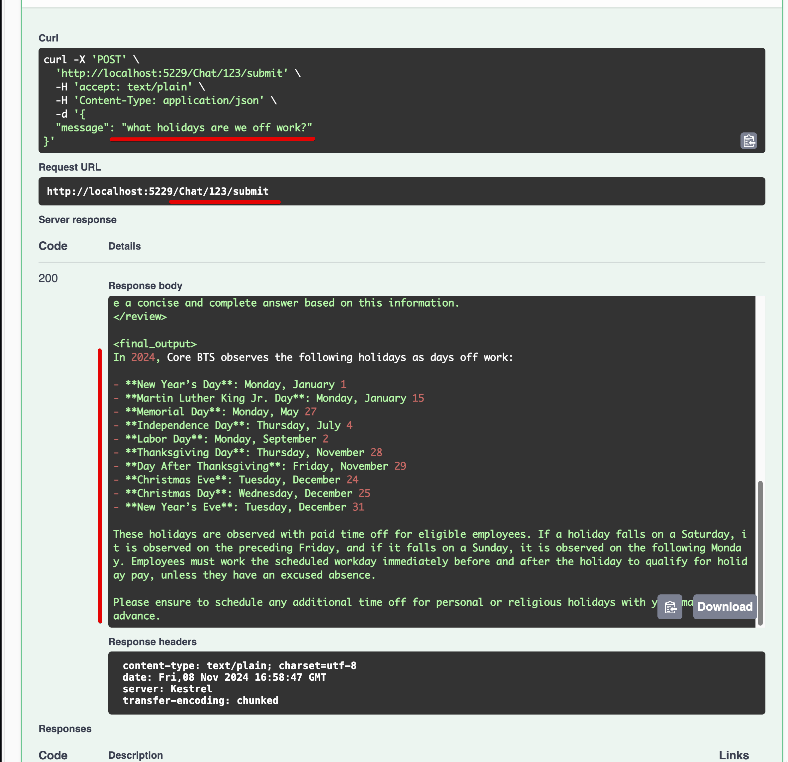

# Enterprise AI Demo

- [Purpose](#purpose)
- [Tech Stack](#tech-stack)
- [Project Structure](#project-structure)
- [Architecture](#architecture)
- [How it works](#how-it-works)
- [Developer Setup](#developer-setup)
  - [Install Required Tooling](#install-required-tooling)
  - [Clone the Repository](#clone-the-repository)
  - [Setup Local Configuration](#setup-local-configuration)
  - [Build and Run the Project Locally](#build-and-run-the-project-locally)
- [External APIs](#external-apis)
- [Exposed Endpoints](#exposed-endpoints)
  - [Chat API Endpoints](#chat-api-endpoints)
    - [Get Conversation History](#get-conversation-history)
    - [Submit Message](#submit-message)

## Purpose

A demo project showcasing how to build AI chat applications using Dotnet Core andMicrosoft's Semantic Kernel library. It demonstrates retrieval-augmented generation (RAG) patterns by combining Azure OpenAI with Azure Cognitive Search to provide context-aware responses.



## Tech Stack

| Name                | What is it?                                                                                                         |
| ------------------- | ------------------------------------------------------------------------------------------------------------------- |
| **ASP.NET Core**    | A cross-platform framework for building modern web APIs and services, providing the foundation for the API backend. |
| **Semantic Kernel** | Microsoft's AI orchestration framework that integrates with Azure OpenAI, handling chat completions and embeddings. |
| **Azure OpenAI**    | Provides the AI models (GPT-4) and embedding services for generating responses and vector representations.          |
| **Azure AI Search** | Vector and semantic search service used for RAG (Retrieval Augmented Generation) to provide context to the AI.      |
| **Swagger/OpenAPI** | API documentation and testing interface, implemented via Swashbuckle.AspNetCore package.                            |

## Project Structure

| Path               | Purpose                                                                     |
| ------------------ | --------------------------------------------------------------------------- |
| /EnterpriseAI.Core | Contains the core business logic and services used across the project.      |
| /EnterpriseAI.API  | Hosts the Web API implementation, including controllers and configurations. |
| /EnterpriseAI.CLI  | Contains the console application for testing core functionalities.          |
| /docs              | Provides documentation related to project setup and development.            |

## Architecture


- **Backend (API Server)**:

  - **Technology**: ASP.NET Core
  - **Role**: Hosts the web API for chat interactions.
  - **Connections**: Integrates with Azure OpenAI and Search services for AI-driven functionalities.
  - **Hosting**: Can be hosted locally or on a cloud platform.

- **CLI Application**:

  - **Technology**: .NET Console Application
  - **Role**: Tests core functionalities of the AI services.
  - **Connections**: Uses the same core services as the API server.

- **Core Class Library**:

  - **Components**: AIServiceConfig, KernelService, ConversationService, ChatRepository, SearchService, etc.
  - **Role**: Manages AI operations, including question extraction and answer generation.
  - **Connections**: Interfaces with Azure services and repositories for data handling.

- **Azure OpenAI and Search Services**:

  - **Role**: Provides AI capabilities and document search functionalities.
  - **Connections**: Accessed by both the API server and CLI application for processing chat interactions.

- **In-Memory and Database Repositories**:

  - **Role**: Store and retrieve chat messages.
  - **Connections**: Used to persist conversation history.
  - **Note**: Database repository is not fully implemented.

## How it works

_High level flow_


_Semantic Kernel orchestrates the RAG process_


Theses diagrams show how:

1. The request flows from the API endpoint through the ConversationService
2. The AnswerGenerator uses Semantic Kernel to orchestrate the RAG process
3. The AzureAISearchPlugin handles vector search:
   - Generates embeddings for the query
   - Searches Azure AI Search for relevant documents
   - Returns context to enhance the AI response
4. The KernelService coordinates between Azure OpenAI and the search plugin
5. The response flows back through the layers with the context-enhanced answer

## Developer Setup

### Install Required Tooling

- Install the [.NET SDK](https://dotnet.microsoft.com/download) (version 6.0 or later).

### Clone the Repository

Open a terminal and clone the project:

```bash
git clone <YOUR_REPO>
cd EnterpriseAI
```

### Setup Local Configuration

Each project (API and CLI) requires its own local settings file for secrets.

1. For the API:

   ```bash
   cd EnterpriseAI.API
   cp appsettings.local.Example.json appsettings.local.json
   # Edit appsettings.local.json with your secrets
   ```

2. For the CLI:

   ```bash
   cd EnterpriseAI.CLI
   cp appsettings.local.Example.json appsettings.local.json
   # Edit appsettings.local.json with your secrets
   ```

> [!NOTE]
> The `appsettings.local.json` files are gitignored and won't be committed.

### Build and Run the Project Locally

1. Restore and build the solution:

   ```bash
   dotnet restore
   dotnet build
   ```

2. Run the API:

   ```bash
   dotnet run --project EnterpriseAI.API
   ```

3. Run the CLI:

   ```bash
   dotnet run --project EnterpriseAI.CLI
   ```

4. Optionally, run the API with watch mode (auto-recompile):

   ```bash
   dotnet watch run --project EnterpriseAI.API
   ```

## External APIs

| Name                 | Usage Explanation                                                         | Source Code                                                               |
| -------------------- | ------------------------------------------------------------------------- | ------------------------------------------------------------------------- |
| Azure OpenAI API     | Used for generating text responses and embeddings in the chatbot.         | [KernelService.cs](EnterpriseAI.Core/Services/KernelService.cs)           |
| Azure Search Service | Used for querying documents with semantic and vector search capabilities. | [AzureSearchService.cs](EnterpriseAI.Core/Services/AzureSearchService.cs) |

## Exposed Endpoints

### Chat API Endpoints

#### Get Conversation History

```http
GET /chat/{conversationId}
```

Retrieves all messages for a specific conversation.

**Parameters:**

- `conversationId` (path parameter): Unique identifier for the conversation

**Response:**

- `200 OK`: Returns an array of chat messages
  ```json
  [
    {
      "role": "user",
      "content": "message content"
    },
    {
      "role": "assistant",
      "content": "response content"
    }
  ]
  ```
- `404 Not Found`: If the conversation doesn't exist

#### Submit Message

```http
POST /chat/{conversationId}/submit
```

Submits a new message to a conversation and gets an AI response.

**Parameters:**

- `conversationId` (path parameter): Unique identifier for the conversation
- Request Body:
  ```json
  {
    "message": "string"
  }
  ```

**Response:**

- `200 OK`: Returns the AI response as a string
- `400 Bad Request`: If the message is empty or invalid
